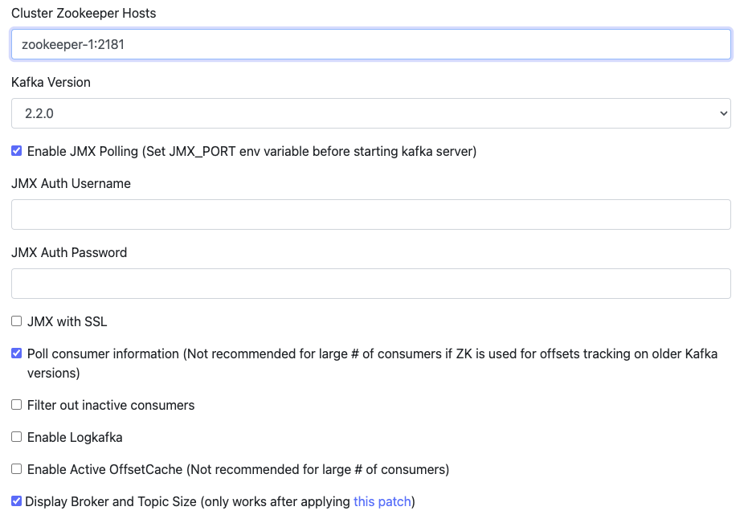
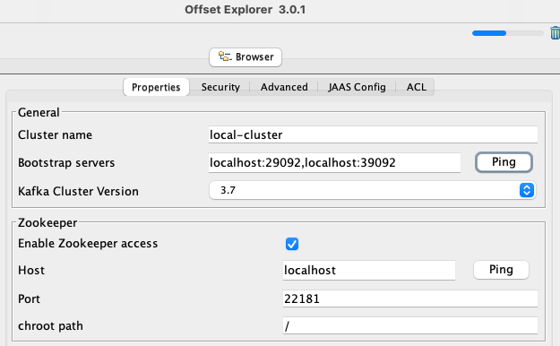

# 실습으로 배우는 선착순 이벤트 시스템

인프런 - 실습으로 배우는 선착순 이벤트 시스템 스터디

강의 학습 내용 실습 자료

https://www.inflearn.com/course/%EC%84%A0%EC%B0%A9%EC%88%9C-%EC%9D%B4%EB%B2%A4%ED%8A%B8-%EC%8B%9C%EC%8A%A4%ED%85%9C-%EC%8B%A4%EC%8A%B5

# 환경
- java 17
- Gradle 8.10
- Spring boot 3.3.4

# 레디스 사용 명령어
- redis-cli : 레디스 커맨드라인 인터페이스
- incr key : 1씩 증가
- sadd key member : sets 추가

# Local 개발환경을 위한 Docker
- 실행방법
  ```
  $ cd docker && docker-compose up -d
  ```
- 도커 종료방법
  ```
  $ cd docker && docker-compose down -v
  ```

- 토픽 생성
  ``` 
  docker-compose exec kafka-1 kafka-topics --create --topic coupon_create --bootstrap-server kafka-1:9092 --replication-factor 1 --partitions 1
  ```
- 토픽 확인
  ``` 
  docker-compose exec kafka-1 kafka-topics --describe --topic coupon_create --bootstrap-server kafka-1:9092
  ```
- 컨슈머 수동 실행 방법
  ```
  $ docker-compose exec kafka-1 bash
  [appuser@e1e76e76f9f3 ~]$ kafka-console-consumer --topic coupon_create --bootstrap-server kafka-1:9092
  ```
- 프로듀서 수동 실행 방법
  ```
  docker-compose exec kafka-1 bash 
  [appuser@e1e76e76f9f3 ~]$ kafka-console-producer --topic coupon_create --broker-list kafka-1:9092
  ```

-  [kafka manager](http://localhost:9000) 설정
    1. [cluster 설정](http://localhost:9000/addCluster)
        - 아래 항목 입력후 save 버튼 클릭

          | 항목         | 값                                               |
                    |------------|-------------------------------------------------|
          | Cluster Name | local-cluster                                   |
          | Cluster Zookeeper Hosts | zookeeper-1:2181                                |
          | kafka version | 2.2.0                                           |
          | 체크박스 체크 | Enable JMX Polling, Poll consumer information, Display Broker and Topic Size | 
          

    2. [토픽 생성](http://localhost:9000/clusters/local-cluster/createTopic)
        - 아래 항목 입력 후 create 버튼 클릭

       | 항목  | 값                                    |
                  |---|--------------------------------------|
       |Topic| coupon_create |
       |Partitions| 2                                    |
       |Replication Factor| 2                                    |

# 구동
local: http://localhost:8080

### 카프카에 등록된 메세지 확인하고 싶은 경우
1. kafka ui tool([offset Explorer](https://www.kafkatool.com/download.html)) 다운로드 및 설치
2. cluster 추가
  - 아래 항목 입력
    1. cluster Name 입력
    2. Properties 탭 입력
       - Bootstrap servers : localhost:29092,localhost:39092
       - Zookeeper Host : localhost
       - Zookeeper Port : 22181
4. 메세지 확인
  1. 좌측 Topics 하위의 internal-product-search-queuing-json 선택
  2. 상단 Properties 탭 Content Types Key,Value 값 String 으로 변경후 update 클릭
  3. 상단 Data 탭에서 메세지 확인

